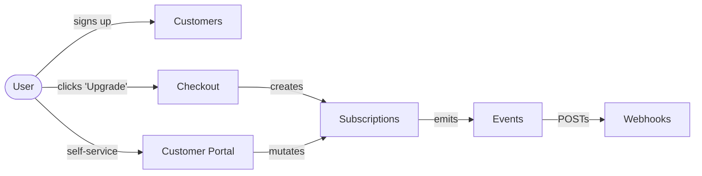

# Lesson 5.2 — Stripe API & Docs

## Pin the API version

The Stripe API is versioned by date. Every account is created with a
default version, and **every API call your code makes should explicitly
declare the version it was written against** so a Dashboard-side
upgrade never silently changes behavior in production.

Contactly pins to:

```text
2026-03-25.dahlia
```

This is the latest version at the time of writing
([changelog](https://docs.stripe.com/changelog.md)). When we install
the Node SDK in Lesson 6.1 we'll set it via the SDK constructor
(`apiVersion: '2026-03-25.dahlia'`). Until then, the only place this
string lives is here, in this doc.

> **Don't auto-upgrade in production.** When a new API version ships,
> upgrade in a feature branch, run the full e2e + webhook suite against
> the test account, and ship the version bump as its own commit. Module
> 6.1 walks through the exact upgrade flow and includes the
> `upgrade-stripe` skill the agent uses for this.

## The five surfaces Contactly will use

Stripe's API is enormous, but a SaaS-with-subscriptions integration
only touches a small, well-defined slice. Memorize this map — it's the
mental model the rest of the course assumes.



| Surface             | API resource(s)                                                                                                                                                                               | Built in lesson | Why we use this and not the alternative                                                                                                |
| ------------------- | --------------------------------------------------------------------------------------------------------------------------------------------------------------------------------------------- | --------------- | -------------------------------------------------------------------------------------------------------------------------------------- |
| **Customers**       | [`Customer`](https://docs.stripe.com/api/customers.md)                                                                                                                                        | 7.3             | One Stripe Customer per Contactly user (ADR-002). Created lazily on first checkout, kept in sync via webhook.                          |
| **Checkout**        | [Checkout Sessions](https://docs.stripe.com/api/checkout/sessions.md) `mode: 'subscription'`                                                                                                  | 9.1             | Hosted page; we don't take card data. PCI scope = SAQ A. Free trial, tax, coupon, address collection are flags, not features we build. |
| **Subscriptions**   | [`Subscription`](https://docs.stripe.com/api/subscriptions.md), [`SubscriptionItem`](https://docs.stripe.com/api/subscription_items.md), [`Invoice`](https://docs.stripe.com/api/invoices.md) | 7.4             | Stripe runs the renewal loop, dunning, proration. We mirror the state into our DB; we never compute `next_invoice_date` ourselves.     |
| **Customer Portal** | [Billing Portal Sessions](https://docs.stripe.com/api/customer_portal/sessions.md)                                                                                                            | 9.7–9.8         | Self-service upgrade/downgrade/cancel/payment-method-update. Configured once in the Dashboard, opened on demand from the app.          |
| **Webhooks**        | [`WebhookEndpoint`](https://docs.stripe.com/api/webhook_endpoints.md), [`Event`](https://docs.stripe.com/api/events.md)                                                                       | 6.2–6.3         | The **only** trustworthy signal that something happened in Stripe. Polling is anti-pattern; signature verification is mandatory.       |

What Contactly **does not use** (and why):

- **PaymentIntents directly** — we never collect a card without it
  belonging to a subscription. Use Checkout Sessions with
  `mode: 'subscription'`. The Stripe best-practices skill is explicit:
  "Don't build manual subscription renewal loops using raw
  PaymentIntents."
- **Plans (the deprecated object)** — Prices superseded Plans years
  ago. Code that references `plan_xxx` IDs is legacy.
- **Connect / Accounts v2** — Contactly is a single-merchant SaaS, not a
  marketplace. If we ever pivot to "Contactly Marketplace" we add it
  later as ADR-008.
- **Treasury / Issuing** — out of scope.

## Idempotency, always

Every Stripe API mutation Contactly makes will pass an
[`Idempotency-Key`](https://docs.stripe.com/api/idempotent_requests.md)
header derived from a stable, request-scoped value (e.g. the form
nonce, the user ID + intent name, or a UUIDv7 we generate before the
call). This makes retries safe: a webhook handler that fails halfway
through and gets re-delivered, or a user double-clicking "Upgrade",
will not produce a duplicate Subscription.

The Node SDK lifts this to `{ idempotencyKey: '...' }` in the request
options of every method. Module 6.1 wires this in.

## Webhooks are async, idempotent, and untrusted-by-default

Three properties to internalize before Module 6:

1. **Async.** When you create a Checkout Session, the Subscription
   doesn't exist yet — it's created when the customer completes
   payment, and you find out about it via the
   `checkout.session.completed` webhook. Build flows that assume the
   side-effect happens later, not in the response to your API call.
2. **Idempotent.** Stripe will retry a webhook up to ~3 days if you
   return non-2xx. Your handler must be safe to receive the same event
   twice (we do this with a unique-on-`event.id` insert into
   `stripe_events` in Module 6.4).
3. **Untrusted by default.** A POST to `/api/webhooks/stripe` is just
   a POST. Until you've called
   [`stripe.webhooks.constructEvent(payload, sig, secret)`](https://docs.stripe.com/webhooks.md#verify-events)
   and it returned successfully, treat the body as adversarial. We
   verify on every request, no exceptions.

## Reference URLs to bookmark

| What                      | URL                                                                   |
| ------------------------- | --------------------------------------------------------------------- |
| API reference (versioned) | <https://docs.stripe.com/api>                                         |
| API changelog             | <https://docs.stripe.com/changelog>                                   |
| SaaS billing guide        | <https://docs.stripe.com/saas>                                        |
| Subscription design       | <https://docs.stripe.com/billing/subscriptions/design-an-integration> |
| Webhook reference         | <https://docs.stripe.com/webhooks>                                    |
| Test cards                | <https://docs.stripe.com/testing>                                     |
| Test clocks (time travel) | <https://docs.stripe.com/billing/testing/test-clocks>                 |
| API key best practices    | <https://docs.stripe.com/keys-best-practices>                         |
| Go-live checklist         | <https://docs.stripe.com/get-started/checklist/go-live>               |

If your IDE has an MCP integration with the Stripe docs (the
`stripe-best-practices` skill in this repo gates that), prefer the
local skill over the website — it ships the same content versioned
with the code.
